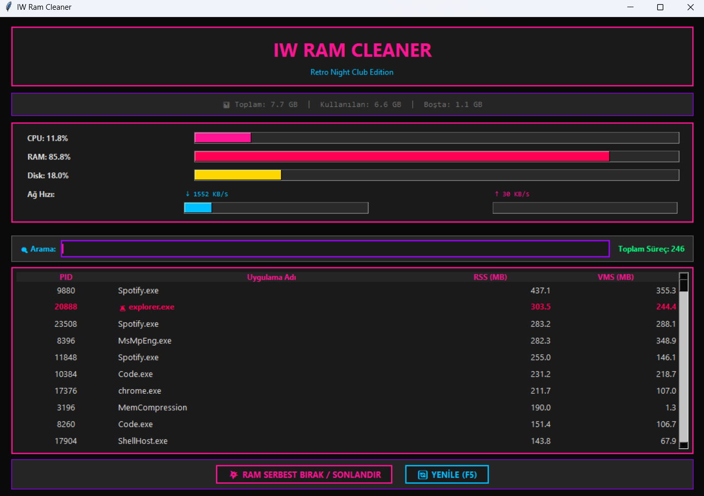

# 🌌 IW Ram Cleaner | Retro Night Club Edition

<div align="center">
  
  
  
  
  
  
</div>

## 🌟 Proje Hakkında

**IW Ram Cleaner**, sisteminizdeki RAM (Bellek) tüketimini yönetmek için tasarlanmış, güçlü ve estetik bir Python uygulamasıdır. Yüksek kaynak kullanan veya yanıt vermeyen süreçleri kolayca tespit etmenizi sağlar ve akıllı **güvenli sonlandırma (Safe Kill)** mekanizması ile sistem kararlılığınızı koruyarak anında bellek serbestleştirme imkanı sunar.

Uygulama, klasik **"Retro Night Club Game"** estetiği ile tasarlanmıştır; karanlık arka planlar, neon renkler (Cyan ve Pembe) ve `Consolas` yazı tipi kullanarak sistem yönetimine dinamik ve eğlenceli bir yaklaşım getirir.



### ✨ Güçlü Özellikler

| Özellik | Detaylı Açıklama |
| :--- | :--- |
| **🛡️ Akıllı Koruma (Safe Kill)** | Uygulama, `csrss.exe`, `winlogon.exe` gibi kritik Windows sistem süreçlerini tanır. Bu süreçlerin yanlışlıkla sonlandırılması otomatik olarak engellenir ve kullanıcıya sistemi çökme potansiyeli hakkında güçlü bir uyarı sunulur. |
| **📈 Detaylı Bellek Metrikleri** | Süreç listesinde iki önemli bellek metriği yer alır: **RSS (Resident Set Size)**: Sürecin fiziksel RAM'de (Gerçek RAM) kullandığı miktar. **VMS (Virtual Memory Size)**: Sürecin tahsis ettiği toplam sanal bellek miktarı. |
| **📊 Sistem RAM Genel Bakışı** | Pencerenin üst kısmında, sisteminizin **Toplam**, **Kullanılan** ve **Boş** RAM miktarlarını gösteren anlık, güncel bilgi çubuğu bulunur. |
| **🔍 Çoklu Seçim ve Filtreleme** | Tek bir tıklama ve sürükleme hareketiyle veya **`Ctrl` / `Shift`** tuşlarıyla birden fazla süreci seçin. Üstteki arama kutusu, süreç **Adı** veya **PID** (İşlem Numarası) ile anında, yüksek performanslı filtreleme sağlar. |
| **🔝 Akıllı Sıralama** | Liste, başlangıçta **en çok RAM (RSS)** kullanan uygulamaları üste getiren **akıllı sıralama** ile açılır. Sütun başlıklarına tıklayarak sıralamayı değiştirebilirsiniz; ilk tıklama azalan (en yüksek üstte), sonraki tıklama ise artan düzene geçirir ve sıralama sayısal/alfabetik olarak doğru yapılır. |
| **⚡ Gelişmiş Kullanıcı Deneyimi (UX)** | Uygulama, hızlı etkileşim için klavye kısayollarını destekler: **`F5`** ile listeyi yenileme ve **`Delete`** ile seçili süreçleri sonlandırma. Ayrıca, butonlar üzerinde bilgi sağlayan **Tooltip'ler** bulunur. |

-----

## ⚙️ Kurulum ve Başlatma

Bu uygulamayı çalıştırmak için **Python 3.x** ve **`psutil`** kütüphanesine ihtiyacınız vardır.

### 1\. Kütüphane Kurulumu

Aşağıdaki komutu kullanarak gerekli bağımlılıkları kurun:

```bash
pip install psutil
```

### 2\. Başlatma

Kodu kaydettiğiniz dosyayı (örneğin `iw_ram_cleaner.py`) terminalde çalıştırın:

```bash
python iw_ram_cleaner.py
```

> 🚨 **Yönetici Yetkisi:** Windows veya Linux sistemlerinde kritik süreçleri güvenilir bir şekilde sonlandırmak için uygulamayı **Yönetici/Root** yetkileriyle çalıştırmanız önerilir.

-----

## ⬇️ Kullanıcı İndirme ve Başlatma

Uygulamanın çalıştırılabilir (.exe) versiyonunu indirmek için lütfen **GitHub Releases** sayfasına gidin ve en güncel sürümü (örneğin v0.1.0-beta etiketi altındaki **iwrc.exe** dosyasını) indirin.

## 🖥️ Kullanım Rehberi

1. **Üst Panel** → CPU, RAM, Disk ve Ağ hızınızı gerçek zamanlı izleyin.
2. **RAM Durumu** → Toplam / Kullanılan / Boşta bellek miktarları detaylı gösterilir.
3. **Süreç Listesi** → En çok RAM tüketen süreçler başta gelir. Kritik olanlar 🚨 ile işaretlenir.
4. **Arama** → Süreç adı veya PID yazarak hızlı filtreleme yapın.
5. **Sonlandırma**
   - Bir veya birden fazla süreci seçin (`Ctrl` / `Shift` veya sürükle).
   - `💥 RAM SERBEST BIRAK / SONLANDIR` butonuna tıklayın ya da `Delete` tuşuna basın.
   - Kritik süreçler otomatik engellenir, onay istenir.
6. **Yenileme** → `🔄 YENİLE (F5)` butonu veya F5 tuşu ile tüm verileri güncelleyin.

-----

## 🎨 Retro Tema Renk Şeması

| Bileşen          | Hex Kodu    | Açıklama                  |
|------------------|-------------|---------------------------|
| **Derin Arka Plan** | `#0a0a0a`   | Ana BG                    |
| **Katman 1**        | `#1a1a1a`   | Paneller                  |
| **Katman 2**        | `#252525`   | İç çerçeveler             |
| **Neon Cyan**       | `#00BFFF`   | RAM, normal butonlar      |
| **Neon Pembe**      | `#FF1493`   | Başlıklar, kill butonu    |
| **Neon Mor**        | `#9D00FF`   | Border ve vurgular        |
| **Neon Kırmızı**    | `#FF0055`   | Kritik uyarılar           |
| **Neon Yeşil**      | `#00FF7F`   | İstatistikler             |

-----

## 🤝 Katkıda Bulunma

1. Fork edin
2. Feature branch oluşturun (`git checkout -b feature/AmazingFeature`)
3. Commit edin (`git commit -m 'Add some AmazingFeature'`)
4. Push edin (`git push origin feature/AmazingFeature`)
5. Pull Request açın

Detaylar için [CONTRIBUTING.md](CONTRIBUTING.md) ve [CODE_OF_CONDUCT.md](CODE_OF_CONDUCT.md) dosyasını inceleyiniz.

## 📄 Lisans

Bu proje MIT lisansı altında dağıtılmaktadır. Detaylar için [LICENSE.md](LICENSE.md) dosyasını inceleyiniz.
